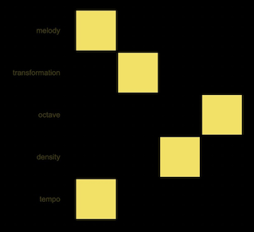
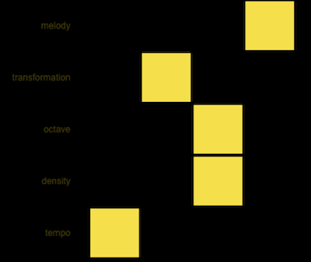

# Atoms

Atoms is a generative NFT musical and visual art project.

Nature is full of patterns, tiny little patterns that create everything from tiny cells to galaxies. Atoms explores taking short melodic patterns and uses algorythms to morph them into thousounds of differnt musical building blocks. Those `blocks` can then be combined into compositions. So the entire compositions are created from manipulating those simple melody patterns.

Atoms will have different collections, each collection will have a collab between one composer and one visual artist but there will be familiar UI for collectors to use for selecting `blocks` and creating `compositions`. Each collection will have it's own unique algorythms, sounds and visuals as well as traits and rarity.

Atoms is 100% on chain and open source and licenced as CC0 so you can do what ever! Create derative projects or whatever you fancy.

Atoms NFT owners will get royalities when others use a block owned by them in a composition. Each wallet can mint 3 NFTs.

## How it works?

### Phase 1

You go to <https://atoms.io> and explore the posibillities by clicking the squares.
Each square changes the transformations applied to the melody.

Each row has a label that indicates how that row changes the music/visuals. For example a row can be melody picker, octive shifter, tempo changer etc. Each collection will have it's own controls and algorhythm.

When you have found a `block` that you like you can mint it, after that nobody else will be able to mint this block.

There are 6^5 = 7776 blocks possible but only the first 2048 blocks will be added to the collection.

The minting price is 0.08 ETH.

### Phase 2

You can now combine your block(s) with blocks minted by others to create a composition. You simply go to <https://atoms.io> and login with MetaMask.

Click `EXPLORE` to start exploring and rehearsing and when you are ready you click the `REC` button. After performing your composition you can click `STOP` and then
`LISTEN`. If you are happy with your composition you can click `MINT COMPOSITION`, give it a title and put in your artist name and your compostion is on the blockchain forever, ready to be sold as an 1/1.

Minting compostions costs 0.04 ETH and the amount goes 100% to block owners as royalitis for using their blocks.

### Phase 3

Phase 3 depends on each collection. The first collection will have a competition where you can submit your composition. One composition will be selected as winner, rendered as sheet music and performed by a pianist. That 1/1 performance will be airdropped to the winner.

## Wen Whitelist ?

TBA

## How can I contribute

There will be tests on Rinkeby test network and we will user testing via video calls to make sure we are on the right track. How to get in touch? TBA
